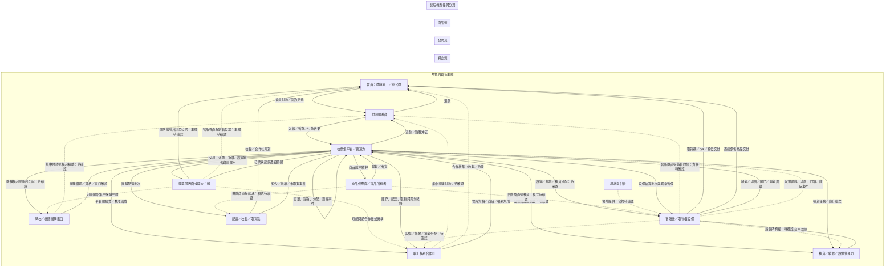

# 校鮮集商品定價、會員點數回饋、利潤分配與三流架構

**文件性質：**校鮮集專案需求與營運模型草案，不是正式價格表、法律意見、會計意見、稅務意見、申報規則或正式技術規格。

**文件版本：**v0.2

**日期：**2026-09-28

**專案隔離：**本文件只處理校鮮集。不得直接套用萬佳鄉、雲鼎 ERP、StallPay 或其他專案的客戶、商品、價格、門店、mapping、稅率、分潤、endpoint 或正式帳務規則。

**價格狀態：**本文件不填正式金額；所有價格、比例、稅率、點數換算與分配比例均為 `[TODO: 待人工確認]`。正式對外文案須標示適用通路、版本日期，並加註「以官網最新價格為準」。

---

## 1. 核心營運判定

校鮮集同時服務：

- 學校、軍公教與其他機構的團購單位。
- 各單位內或相關的職工福利合作社。
- 教職員工、軍公教人員、合作社社員／準社員或其他經核准會員。

定價與分配不可只以「一筆訂單」或「一個校點」判斷，應同時保存：

- `company_id`：校鮮集服務範圍或租戶 scope。
- `organization_id`：學校、機關或服務單位。
- `cooperative_id`：職工福利合作社 scope。
- `legal_entity_id`：實際法律／營業主體，待確認。
- `sales_subject_id`：銷售主體，待確認。
- `invoice_issuer_id`：發票開立主體，待確認。
- `settlement_party_id`：結算對象。
- `campaign_id`：團購檔期。
- `order_id`、`order_line_id`、`batch_id`：訂單與批次追蹤。
- `pricing_rule_version`、`loyalty_rule_version`、`allocation_rule_version`：規則版本。

### 1.1 不能預設的關係

- 學校／機關不一定是採購、付款或發票主體。
- 合作社不一定是學校的普通部門，也不一定承擔全部銷售責任。
- 會員所屬單位不一定等於付款主體。
- 校點／配送點不一定等於營業主體或庫存所有者。
- 平台服務費、合作社服務費與會員回饋不能在未確認下直接視為利潤。

---

## 2. 商品定價模型

### 2.1 定價層級

| 層級 | 用途 | 是否正式對外價格 |
|---|---|---|
| `reference_cost` | 商品、包材、物流與處理成本參考 | 否，需 owner 確認來源 |
| `list_price` | 一般目錄展示或基準售價 | `[TODO: 待人工確認]` |
| `direct_price` | 直接通路／網站自助訂購方案 | `[TODO: 待人工確認]` |
| `dealer_price` | 經銷通路方案；需標示含真人服務 | `[TODO: 待人工確認]` |
| `enterprise_price` | 企業通路客製報價與 SLA | `[TODO: 待人工確認]` |
| `institution_price` | 學校／機關團購檔期價格 | `[TODO: 待人工確認]` |
| `cooperative_price` | 合作社集中採購或會員服務價格 | `[TODO: 待人工確認]` |
| `member_payable` | 會員實際應付金額 | 由規則計算，不可直接覆寫 |

對外標示原則：

- 若談平台方案價格，明確標示「直接通路／經銷通路／企業通路」。
- 若談商品價格，明確標示「學校／機關團購」或「合作社會員方案」等適用對象。
- 每個價格要有版本日期；目前日期尚未代表正式價格版本。
- 任何正式價格旁加註：「以官網最新價格為準」。

### 2.2 建議定價公式

先以最小貨幣單位計算，避免浮點誤差：

```text
商品基礎成本
+ 包材／處理成本
+ 配送／取貨成本分攤
+ 支付或通路成本
+ 平台／客服／營運成本分攤
+ 風險預留
+ 目標貢獻額
= 未套用優惠前的基準價格
```

會員實付：

```text
member_payable
= channel_or_institution_price
- campaign_discount
- approved_subsidy
- points_redeemed_amount
+ delivery_fee
+ other_approved_charge
```

上述各欄位的含稅／未稅定義、稅率與四捨五入規則均為 `[TODO: 待人工確認]`。

### 2.3 團購價格設計原則

#### 學校／機關團購

適合依下列條件建立規則：

- 團購檔期與收單截止。
- 最低成團量或最低配送條件。
- 配送至單一校點或多校點的成本差異。
- 會員個人下單或機構集中下單。
- 取消、退款、缺貨與替代品政策。
- 是否由團購窗口取得彙總權限。

#### 軍公教團購

不應因「軍公教」標籤自動推導優惠或資格。應由組織 owner 確認：

- 服務單位是否被核准。
- 會員資格如何取得與多久重驗。
- 是否有專屬檔期、品類或配送條件。
- 會員資料是否足以支持資格判定，且只保存必要欄位。

#### 職工福利合作社

可設計合作社專屬規則，但須區分：

- 合作社集中採購價。
- 合作社會員實付價。
- 合作社承擔的服務／管理成本。
- 平台提供的導入、客服、對帳與配送服務。
- 合作社回饋是會員福利、合作社收入、服務費折抵或其他類型。

### 2.4 最低毛利保護

平台可以提供「毛利保護檢核」，但不能自行判定正式會計毛利。建議檢核：

```text
預估貢獻額
= 會員實付
- 商品成本
- 配送／處理成本
- 支付成本
- 點數兌現成本
- 已核准的合作社／機構回饋
- 已核准的平台服務成本
```

若低於 owner 設定的警戒線：

1. 標記 `pricing_review_required`。
2. 停止自動發布檔期或價格。
3. 送交定價／財務角色人工核准。
4. 保留 audit 與規則版本。

警戒線數值為 `[TODO: 待人工確認]`，不可在本文件中自行填入。

### 2.5 智販機專屬定價

智販機不是單純的取貨設備；若設備直接完成銷售、收款或發票流程，必須建立獨立的設備交易規則。每台設備至少保存：

- `device_id`、設備所在地與所屬組織／合作社。
- 設備所有權主體、營運責任主體與場地提供者。
- 商品／庫存所有權主體。
- 銷售主體、收款主體與發票主體。
- 補貨、維修、溫層與異常處理責任。
- 適用價格版本、設備通路規則與分潤規則。

智販機價格候選層級：

| 層級 | 適用情境 | 狀態 |
|---|---|---|
| `device_list_price` | 設備螢幕／標籤展示價 | `[TODO: 待人工確認]` |
| `device_member_price` | 已登入會員或合作社會員 | `[TODO: 待人工確認]` |
| `device_campaign_price` | 學校／機關團購檔期 | `[TODO: 待人工確認]` |
| `device_walkup_price` | 非檔期現場購買 | `[TODO: 待人工確認]` |
| `device_pickup_fee` | 設備作為取貨服務而非銷售設備時的費用 | `[TODO: 待人工確認]` |

智販機價格計算應額外考慮：設備折舊或租賃、補貨頻率、電力、網路、維修、溫控、場地與設備異常損失。這些成本只作為定價模型欄位，不代表正式會計分類。

若智販機只提供取貨，不直接銷售，會員價格應沿用原訂單價格，設備相關費用另以服務費或配送費規則處理；若智販機直接銷售，則需重新確認銷售、收款與發票責任。

---

## 3. 會員點數與回饋金機制

### 3.1 區分三種概念

| 類型 | 意義 | 主要責任問題 |
|---|---|---|
| 會員點數 | 會員可依規則累積或折抵的帳本單位 | 誰發行、誰核准、何時失效？ |
| 回饋金 | 依訂單、活動或合作社規則產生的金額或權益 | 是會員福利、合作社回饋、費用折抵或其他？ |
| 利潤分配 | 交易完成後對合作方、平台或服務方的結算 | 以何種基礎、何時結算、如何沖正？ |

三者不能使用同一個 `balance` 欄位混合保存。

### 3.2 點數來源

可規劃但尚待 owner 核准：

- 完成訂單回饋。
- 團購達標回饋。
- 合作社活動回饋。
- 機構福利預算補助轉換。
- 服務補償點數。
- 人工調整或客服補發。

每種來源需要獨立 `source_type`、規則版本、核准者與有效期限。

### 3.3 點數入帳流程

```text
訂單／活動完成
→ 判定會員與組織資格
→ 讀取 loyalty_rule_version
→ 計算應發點數
→ 產生 pending ledger entry
→ 條件檢查與人工核准（若必要）
→ posted
→ 會員可使用
```

若訂單付款、配送、取貨、退款或會員資格尚未確定，點數保持 `pending`，不可直接成為可用餘額。

### 3.4 點數使用與沖正

```text
會員使用點數
→ 鎖定點數
→ 訂單完成後扣除
→ 訂單取消／退款時依規則退回或沖正
→ 保留原始 entry 與 reversal entry
```

禁止直接修改歷史 ledger entry。所有人工調整需有：

- 操作者與角色。
- 原因碼。
- 原訂單／活動／批次。
- 前後差異。
- 核准者。
- UTC 時間。

### 3.5 回饋金計算基礎

候選公式如下，正式選項待確認：

```text
回饋基礎 A：商品實付金額
回饋基礎 B：扣除配送費後的商品實付金額
回饋基礎 C：完成且未退款的訂單金額
回饋基礎 D：合作社或機構核准的福利預算
回饋基礎 E：活動固定額度或階梯額度
```

不得把退款、取消、折讓、點數折抵與平台服務費重複計入回饋基礎。

---

## 4. 利潤分配與結算機制

### 4.1 交易經濟分解

每筆訂單應形成可追溯的分解表：

| 項目 | 定義 | 金額／規則狀態 |
|---|---|---|
| 會員應付 | 套用價格與優惠後應付款 | `[TODO: 待人工確認]` |
| 會員實付 | 實際完成付款金額 | 由付款結果決定 |
| 商品成本 | 供應商或庫存所有者成本 | `[TODO: 待人工確認]` |
| 配送／處理 | 揀貨、包材、配送、取貨等成本 | `[TODO: 待人工確認]` |
| 支付／通路成本 | 付款與通路相關成本 | `[TODO: 待人工確認]` |
| 點數兌現成本 | 已使用或應承擔的點數價值 | 由 ledger 決定 |
| 合作社／機構回饋 | 已核准的回饋或服務分配 | `[TODO: 待人工確認]` |
| 平台服務費 | 平台、客服、對帳、導入等服務費 | `[TODO: 待人工確認]` |
| 未分配差異 | 差異、短少、退款或待核對項目 | 暫留，不自動分配 |

### 4.2 候選分配順序

在 owner 核准前，建議採「先保留、後分配」：

```text
付款完成
→ 保留交易與付款證據
→ 扣除已核准的退款／折讓／支付成本
→ 計算商品與配送成本
→ 計算已核准點數／回饋成本
→ 計算平台／合作社／機構服務分配
→ 產生待核對結算批次
→ 人工或規則核准
→ 產生結算結果與匯出草稿
```

若付款、退款、發票、商品成本或會員資格任一項不明，結算批次標記 `manual_review_required`，不得自動撥付或視為正式申報完成。

### 4.3 合作社分配模式

可供 owner 選擇的模型：

#### 模式 A：合作社服務費

合作社提供會員管理、團購窗口、取貨協作或福利規則；平台依合約計算服務費。

#### 模式 B：合作社會員回饋

合作社依合格訂單或活動規則取得會員福利預算，再依合作社規則分配給會員。

#### 模式 C：集中採購差額

合作社集中採購取得價格條件，再由合作社決定會員實付與剩餘差額用途。

#### 模式 D：平台服務費折抵

合作社取得的核准回饋用於折抵平台導入、客服、配送或對帳服務費。

實際模式、收入認列、發票與稅務分類皆為 `[TODO: 待人工確認]`。

#### 模式 E：智販機設備分潤

智販機可採下列候選分配方式，必須逐台設備與合約版本設定，不得只以校點推定：

1. **設備持有人分潤**：設備所有者取得核准的設備服務或銷售分配。
2. **場地提供者分潤**：學校、機關、合作社或其他場地方取得核准的場地服務分配。
3. **補貨／營運方分配**：負責補貨、維修、客服與異常處理者取得服務分配。
4. **合作社福利分配**：合作社依會員或組織規則取得福利預算或服務回饋。
5. **平台服務費**：校鮮集依核准合約取得平台、對帳、通知與維運服務費。

每個分配項目都要標示計算基礎、含稅／未稅狀態、退款與報廢沖正、結算週期與核准者；所有比例與金額維持 `[TODO: 待人工確認]`。

### 4.4 結算批次欄位

每個 `settlement_batch` 至少保存：

- `batch_id`、組織／合作社 scope。
- 結算期間與 UTC 起訖。
- 適用價格、點數與分配規則版本。
- 訂單、退款、折讓與點數 entry 數量。
- 應收、實收、成本、回饋、服務費與未分配差異。
- 發票／憑證狀態與責任主體。
- 付款／退款對帳狀態。
- `manual_review_required` 原因。
- 建立者、覆核者、核准者與 audit trail。

---

## 5. 資金流、發票流與商品流

架構圖另存於：`XIAOXIANJI_FUNDS_INVOICE_GOODS_FLOW.mmd`。



### 5.1 三流共同追蹤鍵

資金流、發票流與商品流不可只靠時間或名稱串接，應共同保留：

- `organization_id`、`cooperative_id`、`campaign_id`。
- `order_id`、`order_line_id`、`payment_reference`。
- `invoice_reference`、`shipment_batch_id`、`pickup_event_id`。
- `settlement_batch_id`、`loyalty_entry_id`。
- `idempotency_key`、規則版本與 UTC 時間。

### 5.2 三流不一致時

- 付款成功但發票未知：保留付款，發票狀態 `pending／manual_review`。
- 發票完成但商品未交付：不可自動標記完整履約，建立配送／退款處理。
- 商品已交付但付款未知：不可重複扣款，進入對帳與人工核對。
- 退款完成但點數未沖正：鎖定後續使用，建立 reversal entry。
- 合作社資格未知：會員福利與回饋保持 pending。
- 智販機交易主體未知：不自動開立發票、不自動完成分潤，保留交易與設備事件待人工核對。
- 智販機庫存與實際出貨不一致：暫停該設備相關結算，建立盤點、補貨或退款事件。
- 智販機開門／取貨結果不明：不可重複開門或重複扣款，維持 `manual_review_required`。
- 智販機溫層、效期或設備健康狀態不明：停止該格位銷售／交付，保留商品與設備 audit。

---

## 6. 角色可見性與治理控制

### 平台／營運管理者

預設看彙總：訂單量、實收摘要、配送完成率、點數待核對、結算差異與發票狀態；逐筆財務與 PII 需依授權。

### 學校／機關團購窗口

只看所屬組織、所屬檔期、彙總與被授權的訂單／取貨資訊；不得預設查看其他組織或會員不必要個資。

### 合作社管理者

可看所屬合作社的會員、商品、檔期、回饋、對帳與匯出；不得跨合作社查看資料。

### 財務／對帳角色

可看所授權組織的交易、退款、發票參照、點數帳本與結算批次；高風險核准需保留 audit。

### 會員

只能看自己的訂單、付款、發票參照、點數與取貨狀態。

---

## 7. Synthetic journeys 與 fail-closed

1. 會員下單 → 付款成功 → 商品配送 → 取貨 → 點數 pending 轉 posted → 結算批次待核准。
2. 合作社集中採購 → 合作社收貨 → 會員分配 → 會員回饋 → 合作社對帳。
3. 付款成功、發票狀態未知 → 不重複扣款 → 發票人工核對。
4. 會員取消或退款 → 點數鎖定／沖正 → 結算批次重算或產生 reversal。
5. 商品短少 → 產生異常事件 → 暫停相關結算 → 人工確認補發／退款。
6. 會員資格未知 → 不發放正式福利 → 保留 pending → 合作社人工確認。
7. 價格規則版本衝突 → 停止發布檔期 → 定價角色核准新版本。
8. 分配基礎不完整 → 保留未分配差異 → 不自動撥付。

---

## 8. Provider-neutral 與資料邊界

建議抽象介面：

- `IPricingProvider`
- `ILoyaltyLedger`
- `ISettlementProvider`
- `IPaymentProvider`
- `IInvoiceProvider`
- `IAccountingProvider`
- `ITaxReportingProvider`
- `IInventoryProvider`
- `INotificationProvider`
- `IEventBus`

智販機另需以 Adapter 隔離設備控制、銷售終端、列印、門鎖／格位、溫層感測與設備健康資料；正式設備型號、API、SLA、責任主體與資料 owner 均為 `[TODO: 待人工確認]`。

正式實作必須由校鮮集 owner 指定：ERP authoritative source、商品／SKU mapping、付款服務商、發票 provider、會計／稅務責任者與 deployment owner。不得因本規劃文件存在就視為已核准。

---

## 9. 待 owner 決策表

| 決策項目 | 目前狀態 |
|---|---|
| 正式商品目錄與成本來源 | `[TODO: 待人工確認]` |
| 學校／機關團購價規則 | `[TODO: 待人工確認]` |
| 合作社集中採購價規則 | `[TODO: 待人工確認]` |
| 直接／經銷／企業通路方案價格 | `[TODO: 待人工確認]` |
| 會員點數發行者與核准者 | `[TODO: 待人工確認]` |
| 點數換算與有效期限 | `[TODO: 待人工確認]` |
| 回饋金性質與會計處理 | `[TODO: 待人工確認]` |
| 合作社分配模式 A／B／C／D | `[TODO: 待人工確認]` |
| 平台服務費與配送費 | `[TODO: 待人工確認]` |
| 會員／合作社／機構付款主體 | `[TODO: 待人工確認]` |
| 銷售與發票主體 | `[TODO: 待人工確認]` |
| 退款、折讓與點數沖正責任 | `[TODO: 待人工確認]` |
| ERP authoritative source | `[TODO: 待人工確認]` |
| 結算週期與撥款日 | `[TODO: 待人工確認]` |
| 會計／稅務專業 owner | `[TODO: 待人工確認]` |
| 智販機是取貨設備或直接銷售設備 | `[TODO: 待人工確認]` |
| 智販機設備所有權與營運責任 | `[TODO: 待人工確認]` |
| 智販機商品／庫存所有權 | `[TODO: 待人工確認]` |
| 智販機銷售、收款與發票主體 | `[TODO: 待人工確認]` |
| 智販機補貨、維修與異常損失責任 | `[TODO: 待人工確認]` |
| 智販機設備、場地、補貨與合作社分配規則 | `[TODO: 待人工確認]` |

---

## 10. 不可推定事項

- 不可將本文件公式當作正式售價、稅率、會計分錄或申報規則。
- 不可把「回饋」直接視為利潤或費用；需由 owner 確認其商業與財務性質。
- 不可把學校、機關、合作社或平台任一方直接視為銷售、收款或發票主體。
- 不可把展示中的 100 所學校視為正式客戶數或營運成果。
- 不可將其他專案的商品、價格、加盟、分潤或稅務模型搬入校鮮集。
- 正式對外價格必須標示適用通路、版本日期與「以官網最新價格為準」。
- 智販機若直接銷售，不得沿用取貨設備的責任假設；必須重新指定銷售、收款、發票、庫存與分潤主體。
